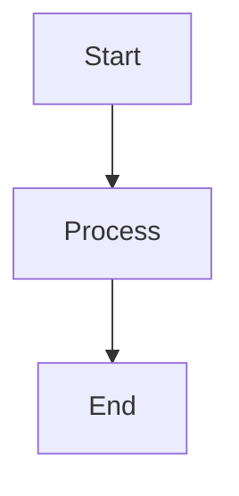
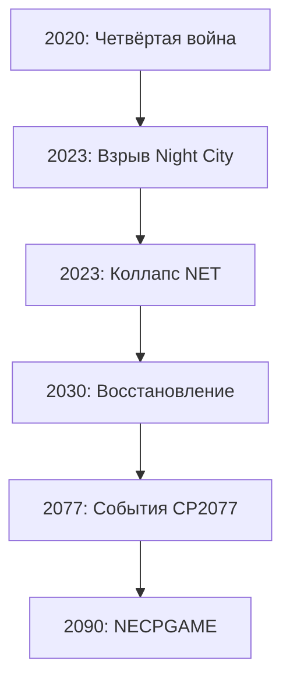

# Архитектура хранения документов сюжетной целостности

**Статус:** approved  
**Версия:** 1.0.0  
**Дата создания:** 2025-11-06  
**Последнее обновление:** 2025-11-06 23:17  
**Приоритет:** высокий

**api-readiness:** not-applicable  
**api-readiness-check-date:** 2025-11-06 23:17  
**api-readiness-notes:** Служебный документ архитектуры, не предназначен для создания API

---

## Принципы организации

### 1. Минимализм

**Правило:** Короткие тематические файлы вместо огромных монолитов

**Ограничения:**
- Максимум 400 строк на файл (правило МЕНЕДЖЕР)
- Один аспект - один файл
- Использовать ссылки вместо дублирования

### 2. Модульность

**Правило:** Каждый документ самодостаточен, но связан с другими

**Структура модуля:**
- Минимальные метаданные (статус, версия, дата, api-readiness)
- Краткое описание (1-2 предложения)
- Основное содержание (структурировано)
- Связи с другими документами (ссылки)
- История изменений

### 3. Граф > Список

**Правило:** Использовать графовое представление для зависимостей

**Форматы:**
- YAML для структурированных данных (граф зависимостей)
- Markdown для описаний
- Mermaid для визуализации

---

## Структура директорий

```
.BRAIN/04-narrative/narrative-coherence/
├── README.md                          # Навигационный документ
│
├── phase1-analysis/                   # Фаза 1: Анализ
│   ├── phase1-inventory.md            # Инвентаризация
│   └── phase1-architecture.md         # Архитектура (этот файл)
│
├── phase2-narrative/                  # Фаза 2: Сюжетная целостность
│   ├── narrative-master-arc.md        # Главная сюжетная линия
│   ├── connections/                   # Связи квестов
│   │   ├── side-quests-matrix.yaml    # Матрица побочных квестов
│   │   ├── quest-triggers.yaml        # Квесты-триггеры
│   │   └── quest-blockers.yaml        # Квесты-блокираторы
│   ├── coherence/                     # Временная логика
│   │   ├── timeline-check.md          # Проверка хронологии
│   │   ├── npc-lifecycle.yaml         # Lifecycle NPC
│   │   ├── faction-evolution.yaml     # Эволюция фракций
│   │   └── location-timeline.yaml     # Timeline локаций
│   └── classes/                       # Классы
│       ├── class-branches.md          # Ветки классов
│       ├── class-dialogues.yaml       # Class-specific диалоги
│       └── class-paths.yaml           # Рекомендуемые пути
│
├── phase3-event-matrix/               # Фаза 3: Событийная матрица
│   ├── architecture.md                # Архитектура графа
│   ├── graph/                         # Графы
│   │   ├── quest-dependencies.yaml    # Зависимости квестов
│   │   ├── world-state-graph.yaml     # Граф состояний мира
│   │   └── critical-paths.yaml        # Критические пути
│   ├── visualization/                 # Визуализация
│   │   ├── main-arc.mermaid.md        # Диаграмма главной линии
│   │   ├── quest-tree.mermaid.md      # Дерево квестов
│   │   └── world-states.mermaid.md    # Состояния мира
│   └── dynamic/                       # Динамический контент
│       ├── content-system.md          # Система генерации
│       ├── event-weights.yaml         # Веса событий
│       └── random-events.yaml         # "Случайные" события
│
├── phase4-database/                   # Фаза 4: База данных
│   ├── analysis/                      # Анализ
│   │   ├── current-tables.md          # Текущие таблицы
│   │   └── gaps-analysis.md           # Анализ пробелов
│   ├── tables/                        # Таблицы
│   │   ├── quest-tables.sql           # Квестовые таблицы
│   │   ├── world-state-tables.sql     # World state таблицы
│   │   ├── player-impact-tables.sql   # Player impact таблицы
│   │   └── indexes.sql                # Индексы
│   ├── optimization/                  # Оптимизация
│   │   ├── partitioning.md            # Партиционирование
│   │   ├── caching.md                 # Кэширование
│   │   └── sharding.md                # Шардинг
│   ├── migrations/                    # Миграции
│   │   ├── 001-expand-quests.sql      # Расширение quests
│   │   ├── 002-add-branches.sql       # Добавление branches
│   │   ├── 003-add-dialogue.sql       # Добавление dialogue
│   │   └── rollback/                  # Rollback скрипты
│   └── documentation/                 # Документация
│       ├── er-diagram.mermaid.md      # ER-диаграмма
│       └── table-reference.md         # Справочник таблиц
│
├── phase5-player-impact/              # Фаза 5: Влияние игроков
│   ├── personal/                      # Личное влияние
│   │   ├── personal-system.md         # Система личного влияния
│   │   ├── personal-flags.yaml        # Персональные флаги
│   │   └── personal-boundaries.md     # Границы влияния
│   ├── server/                        # Коллективное влияние
│   │   ├── server-system.md           # Система сервера
│   │   ├── voting-mechanics.md        # Механика голосования
│   │   └── server-thresholds.yaml     # Пороги изменений
│   ├── faction/                       # Фракционное влияние
│   │   ├── faction-system.md          # Система фракций
│   │   ├── territory-control.yaml     # Контроль территорий
│   │   └── faction-wars.md            # Фракционные войны
│   └── hybrid/                        # Интеграция
│       ├── hybrid-system.md           # Гибридная система
│       ├── priority-matrix.yaml       # Матрица приоритетов
│       └── conflict-resolution.md     # Разрешение конфликтов
│
├── phase6-documentation/              # Фаза 6: Документация
│   ├── maps/                          # Карты
│   │   ├── narrative-map-master.md    # Единая карта (навигатор)
│   │   ├── narrative-arc.mermaid.md   # Диаграмма сюжета
│   │   └── coherence-checklist.md     # Чеклист непротиворечивости
│   ├── visualization/                 # Визуализация
│   │   ├── event-graph.mermaid.md     # Граф событий
│   │   ├── quest-dependencies.mermaid.md # Зависимости квестов
│   │   └── world-states.mermaid.md    # Состояния мира
│   ├── dev-guides/                    # Гайды для разработчиков
│   │   ├── developer-guide.md         # Основной гайд
│   │   ├── api-integration.md         # Интеграция API
│   │   └── code-examples/             # Примеры кода
│   │       ├── quest-branching.java   # Ветвление квестов
│   │       ├── world-state.java       # World state
│   │       └── player-choices.java    # Выборы игрока
│   └── content-guides/                # Гайды для контент-мейкеров
│       ├── content-creator-guide.md   # Основной гайд
│       ├── quest-template.md          # Шаблон квеста
│       └── event-template.md          # Шаблон события
│
├── phase7-validation/                 # Фаза 7: Валидация
│   ├── narrative/                     # Сюжет
│   │   ├── coherence-results.md       # Результаты проверки
│   │   ├── temporal-validation.md     # Временная валидация
│   │   └── dependency-validation.md   # Валидация зависимостей
│   ├── database/                      # БД
│   │   ├── schema-validation.md       # Валидация схемы
│   │   ├── index-coverage.md          # Покрытие индексами
│   │   └── performance-tests.md       # Тесты производительности
│   └── impact-systems/                # Системы влияния
│       ├── personal-tests.md          # Тесты личного влияния
│       ├── server-tests.md            # Тесты сервера
│       ├── faction-tests.md           # Тесты фракций
│       └── conflict-tests.md          # Тесты конфликтов
│
└── phase8-final/                      # Фаза 8: Финальный отчет
    ├── summary.md                     # Общая сводка
    ├── documents-created.md           # Созданные документы
    ├── statistics/                    # Статистика
    │   ├── quest-stats.md             # Статистика квестов
    │   ├── database-stats.md          # Статистика БД
    │   └── graph-stats.md             # Статистика графа
    ├── roadmap/                       # Roadmap
    │   ├── remaining-gaps.md          # Оставшиеся пробелы
    │   ├── priorities.md              # Приоритеты
    │   └── recommendations.md         # Рекомендации
    └── metrics/                       # Метрики
        ├── coverage.md                # Покрытие
        ├── timeline-coverage.md       # Покрытие timeline
        └── dev-effort.md              # Оценка усилий
```

---

## Форматы файлов

### 1. Markdown (.md)

**Использование:** Описания, документация, гайды

**Структура:**
```markdown
# Название документа

**Статус:** draft | review | approved  
**Версия:** X.Y.Z  
**Дата создания:** YYYY-MM-DD  
**Последнее обновление:** YYYY-MM-DD HH:MM  
**Приоритет:** низкий | средний | высокий | критический

**api-readiness:** ready | needs-work | blocked | in-review | not-applicable  
**api-readiness-check-date:** YYYY-MM-DD HH:MM  
**api-readiness-notes:** Заметки

---

## Краткое описание

1-2 предложения о сути документа.

---

## Основное содержание

[Структурированный контент]

---

## Связанные документы

- [Документ 1](./path/to/doc1.md)
- [Документ 2](./path/to/doc2.md)

---

## История изменений

- vX.Y.Z (YYYY-MM-DD HH:MM) - Описание изменений
```

### 2. YAML (.yaml)

**Использование:** Графы, матрицы, структурированные данные

**Структура:**
```yaml
# Название документа
# Версия: X.Y.Z
# Дата: YYYY-MM-DD HH:MM

metadata:
  version: "X.Y.Z"
  created: "YYYY-MM-DD"
  updated: "YYYY-MM-DD HH:MM"
  status: draft | review | approved

content:
  # Основное содержимое
  items:
    - id: item1
      name: "Name"
      data: {}
```

### 3. SQL (.sql)

**Использование:** Схемы БД, миграции

**Структура:**
```sql
-- Migration: XXX-migration-name.sql
-- Version: X.Y.Z
-- Date: YYYY-MM-DD
-- Author: AI Manager

-- Description:
-- [Описание миграции]

-- Dependencies:
-- [Список зависимостей]

BEGIN;

-- [SQL statements]

COMMIT;
```

### 4. Mermaid (.mermaid.md)

**Использование:** Визуализация графов, диаграмм

**Структура:**
```markdown
# Название диаграммы

**Версия:** X.Y.Z  
**Дата:** YYYY-MM-DD

---

## Описание

[Описание диаграммы]

---

## Диаграмма



---

## Легенда

- **A** - Описание узла A
- **B** - Описание узла B
```

---

## Соглашения именования

### Файлы

**Общие правила:**
- Lowercase + дефисы (kebab-case)
- Префикс фазы для основных документов
- Суффикс типа для специальных файлов

**Примеры:**
- `phase1-inventory.md` - основной документ фазы 1
- `quest-dependencies.yaml` - граф зависимостей
- `narrative-arc.mermaid.md` - диаграмма
- `001-expand-quests.sql` - миграция (нумерация)

### Директории

**Правила:**
- Lowercase + дефисы
- Группировка по фазам
- Подгруппировка по темам

**Примеры:**
- `phase2-narrative/` - фаза 2
- `phase3-event-matrix/graph/` - графы фазы 3
- `phase4-database/migrations/` - миграции фазы 4

---

## Система ссылок

### Внутренние ссылки

**Абсолютные (от .BRAIN/):**
```markdown
[Документ](./04-narrative/narrative-coherence/phase2-narrative/narrative-master-arc.md)
```

**Относительные (в той же директории):**
```markdown
[Документ](./narrative-master-arc.md)
```

**Относительные (в поддиректории):**
```markdown
[Документ](./connections/side-quests-matrix.yaml)
```

### Внешние ссылки

**К существующим документам:**
```markdown
[Quest System](./../../quest-system.md)
[Classes Overview](./../../02-gameplay/progression/classes-overview.md)
```

---

## Система версионирования

### Semantic Versioning

**Формат:** X.Y.Z

- **X (Major):** Кардинальные изменения структуры
- **Y (Minor):** Добавление нового контента
- **Z (Patch):** Исправления, мелкие правки

**Примеры:**
- `1.0.0` - Первая версия
- `1.1.0` - Добавлен новый раздел
- `1.1.1` - Исправлена опечатка
- `2.0.0` - Полная переработка структуры

### История изменений

**Формат:**
```markdown
## История изменений

- v2.0.0 (2025-11-06 23:17) - Полная переработка структуры
- v1.1.0 (2025-11-05 10:30) - Добавлен раздел X
- v1.0.0 (2025-11-04 15:00) - Создание документа
```

---

## Метаданные документов

### Обязательные поля

**Для всех документов:**
- `Статус` - draft | review | approved
- `Версия` - X.Y.Z
- `Дата создания` - YYYY-MM-DD
- `Последнее обновление` - YYYY-MM-DD HH:MM
- `Приоритет` - низкий | средний | высокий | критический

**Для документов с механиками:**
- `api-readiness` - ready | needs-work | blocked | in-review | not-applicable
- `api-readiness-check-date` - YYYY-MM-DD HH:MM
- `api-readiness-notes` - Заметки (опционально)

### Дополнительные поля (опционально)

- `Автор` - AI Manager | User
- `Reviewer` - Кто проверил
- `Dependencies` - Зависимости от других документов
- `Tags` - Теги для поиска

---

## Правила коммитов

### Стратегия коммитов

**Правило:** Коммитить после каждой фазы

**Фазы коммитов:**
1. После Фазы 1 (Анализ)
2. После Фазы 2 (Сюжетная целостность)
3. После Фазы 3 (Событийная матрица)
4. После Фазы 4 (База данных)
5. После Фазы 5 (Влияние игроков)
6. После Фазы 6 (Документация)
7. После Фазы 7 (Валидация)
8. После Фазы 8 (Финальный отчет)

**Команда:**
```bash
# Windows
.\scripts\autocommit.ps1 "Phase X: [Описание]"

# Linux/Mac
./scripts/autocommit.sh "Phase X: [Описание]"
```

### Сообщения коммитов

**Формат:**
```
Phase X: [Краткое описание]

Детали:
- [Что сделано 1]
- [Что сделано 2]
- [Что сделано 3]

Создано документов: N
```

---

## Чеклист создания документа

**Перед созданием документа:**
- [ ] Определить тип документа (MD/YAML/SQL/Mermaid)
- [ ] Выбрать имя файла (по соглашению)
- [ ] Определить директорию (по архитектуре)
- [ ] Проверить связи с другими документами

**При создании документа:**
- [ ] Добавить все обязательные метаданные
- [ ] Написать краткое описание
- [ ] Структурировать содержание
- [ ] Добавить ссылки на связанные документы
- [ ] Добавить историю изменений

**После создания документа:**
- [ ] Проверить форматирование
- [ ] Проверить ссылки
- [ ] Обновить родительский документ (если есть)
- [ ] Обновить README.md директории (если нужно)

---

## Примеры использования

### Пример 1: Создание графа зависимостей

**Файл:** `phase3-event-matrix/graph/quest-dependencies.yaml`

```yaml
# Quest Dependencies Graph
# Version: 1.0.0
# Date: 2025-11-06 23:17

metadata:
  version: "1.0.0"
  created: "2025-11-06"
  updated: "2025-11-06 23:17"
  status: approved
  description: "Полный граф зависимостей квестов 2020-2093"

quests:
  - id: "MQ-2020-001"
    name: "Первые шаги"
    type: main
    era: "2020-2030"
    prerequisites: []
    unlocks:
      - "MQ-2020-002"
      - "SQ-2020-001"
    blocks: []
    influences:
      - quest: "MQ-2030-001"
        condition: "if_choice_netwatch"
```

### Пример 2: Создание диаграммы сюжета

**Файл:** `phase6-documentation/maps/narrative-arc.mermaid.md`

```markdown
# Диаграмма главной сюжетной линии 2020-2093

**Версия:** 1.0.0  
**Дата:** 2025-11-06

---

## Описание

Визуализация главной сюжетной линии через все эпохи.

---

## Диаграмма



---

## Легенда

- **Красные узлы** - Критические события
- **Синие узлы** - Точки выбора игрока
```

---

## История изменений

- v1.0.0 (2025-11-06 23:17) - Создание архитектуры хранения документов

