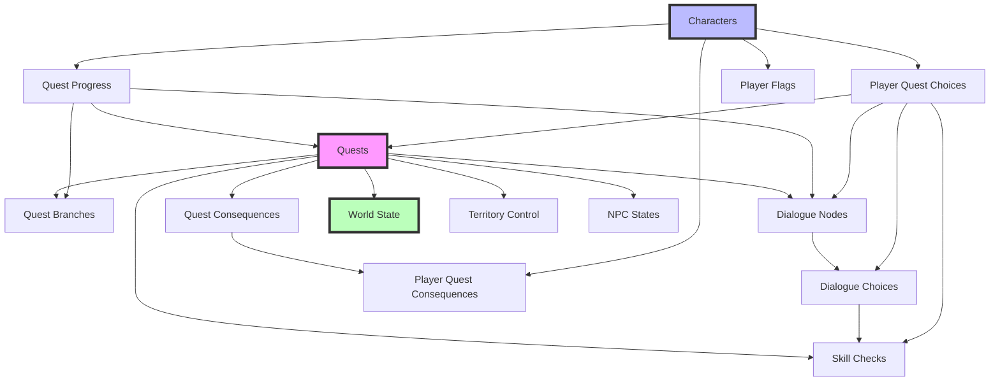
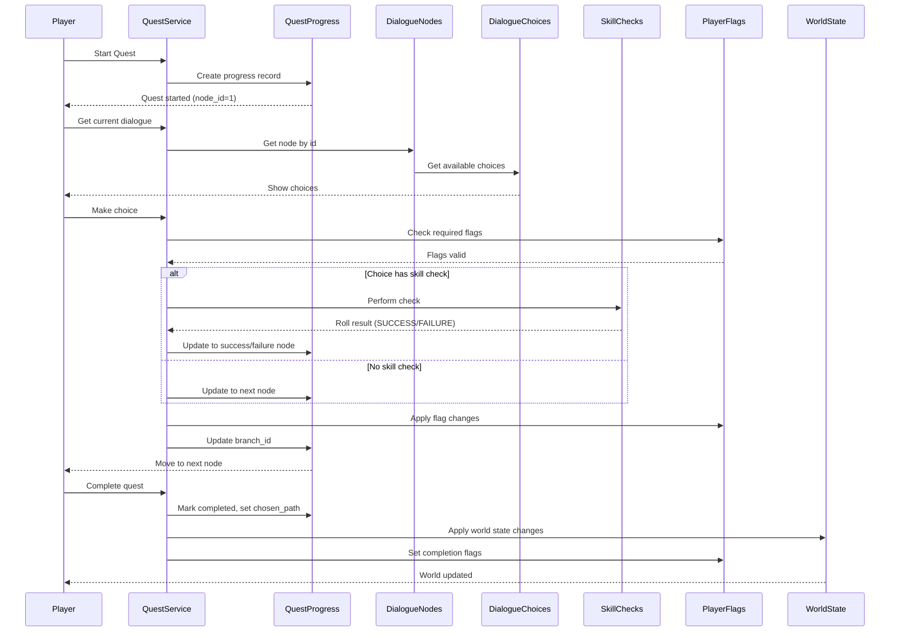
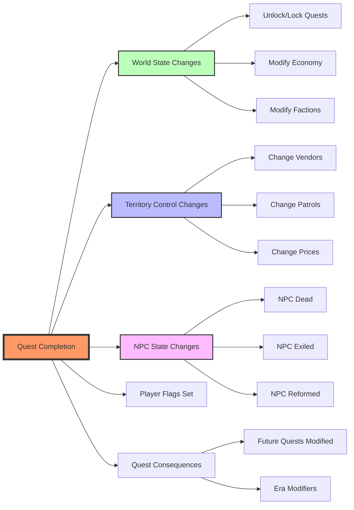

# ER-диаграмма: Структура БД для Ветвления Квестов

**Статус:** in-progress  
**Версия:** 1.0.0  
**Дата создания:** 2025-11-06  
**Последнее обновление:** 2025-11-06 20:31  

---

## Полная ER-диаграмма

```mermaid
erDiagram
    %% Основные сущности
    
    QUESTS ||--o{ QUEST_BRANCHES : "has"
    QUESTS ||--o{ DIALOGUE_NODES : "contains"
    QUESTS ||--o{ SKILL_CHECKS : "includes"
    QUESTS ||--o{ QUEST_PROGRESS : "tracked_by"
    QUESTS ||--o{ QUEST_CONSEQUENCES : "causes"
    
    QUEST_BRANCHES ||--o{ QUEST_PROGRESS : "current_branch"
    
    DIALOGUE_NODES ||--o{ DIALOGUE_CHOICES : "has"
    DIALOGUE_NODES ||--o{ QUEST_PROGRESS : "current_node"
    DIALOGUE_NODES ||--o{ PLAYER_QUEST_CHOICES : "chosen_at"
    
    DIALOGUE_CHOICES }o--|| DIALOGUE_NODES : "leads_to"
    DIALOGUE_CHOICES }o--|| SKILL_CHECKS : "requires"
    DIALOGUE_CHOICES ||--o{ PLAYER_QUEST_CHOICES : "selected"
    
    SKILL_CHECKS }o--|| DIALOGUE_NODES : "success_node"
    SKILL_CHECKS }o--|| DIALOGUE_NODES : "failure_node"
    SKILL_CHECKS }o--|| DIALOGUE_NODES : "crit_success_node"
    SKILL_CHECKS }o--|| DIALOGUE_NODES : "crit_failure_node"
    SKILL_CHECKS ||--o{ PLAYER_QUEST_CHOICES : "performed"
    
    CHARACTERS ||--o{ QUEST_PROGRESS : "has"
    CHARACTERS ||--o{ PLAYER_QUEST_CHOICES : "makes"
    CHARACTERS ||--o{ PLAYER_FLAGS : "has"
    CHARACTERS ||--o{ PLAYER_QUEST_CONSEQUENCES : "receives"
    
    QUEST_PROGRESS }o--|| CHARACTERS : "belongs_to"
    QUEST_PROGRESS }o--|| QUESTS : "tracks"
    QUEST_PROGRESS }o--o| QUEST_BRANCHES : "on_branch"
    QUEST_PROGRESS }o--o| DIALOGUE_NODES : "at_node"
    
    PLAYER_QUEST_CHOICES }o--|| CHARACTERS : "made_by"
    PLAYER_QUEST_CHOICES }o--|| QUESTS : "in_quest"
    PLAYER_QUEST_CHOICES }o--|| DIALOGUE_NODES : "at_node"
    PLAYER_QUEST_CHOICES }o--o| SKILL_CHECKS : "with_check"
    
    PLAYER_FLAGS }o--|| CHARACTERS : "belongs_to"
    PLAYER_FLAGS }o--o| QUESTS : "set_by"
    
    QUEST_CONSEQUENCES }o--|| QUESTS : "from_quest"
    QUEST_CONSEQUENCES }o--o| QUESTS : "affects_quest"
    
    PLAYER_QUEST_CONSEQUENCES }o--|| CHARACTERS : "applied_to"
    PLAYER_QUEST_CONSEQUENCES }o--|| QUEST_CONSEQUENCES : "is_instance_of"
    PLAYER_QUEST_CONSEQUENCES }o--|| QUESTS : "from_quest"
    
    WORLD_STATE ||--o{ WORLD_STATE_HISTORY : "has_history"
    WORLD_STATE }o--o| QUESTS : "changed_by"
    
    WORLD_STATE_HISTORY }o--o| QUESTS : "changed_by"
    WORLD_STATE_HISTORY }o--o| CHARACTERS : "triggered_by"
    
    TERRITORY_CONTROL }o--|| FACTIONS : "controlled_by"
    TERRITORY_CONTROL }o--o| FACTIONS : "challenged_by"
    TERRITORY_CONTROL }o--o| QUESTS : "changed_by"
    
    NPC_STATES }o--|| NPCS : "state_of"
    NPC_STATES }o--o| QUESTS : "fate_by"
    NPC_STATES }o--o| CHARACTERS : "fate_by_player"
    
    NPCS ||--o{ DIALOGUE_NODES : "speaks_in"
    NPCS ||--o{ QUESTS : "gives"
    
    %% Определения таблиц
    
    QUESTS {
        varchar(100) id PK
        varchar(200) name
        text description
        varchar(20) type
        varchar(50) category
        varchar(20) difficulty
        integer min_level
        integer max_level
        jsonb required_quests
        jsonb required_flags
        jsonb required_reputation
        varchar(50) required_class
        varchar(50) required_origin
        boolean has_branches
        integer dialogue_tree_root FK
        jsonb objectives
        integer reward_experience
        integer reward_money
        jsonb reward_items
        jsonb reward_reputation
        varchar(20) era
        varchar(100) region
        varchar(100) giver_npc_id FK
        integer estimated_duration
        boolean is_repeatable
        integer cooldown_hours
        integer max_concurrent_players
        jsonb tags
        jsonb related_quests
        boolean is_active
        integer version
        timestamp created_at
        timestamp updated_at
        varchar(100) created_by
    }
    
    QUEST_BRANCHES {
        serial id PK
        varchar(100) quest_id FK
        varchar(50) branch_id
        varchar(200) branch_name
        text description
        jsonb conditions
        jsonb reward_modifiers
        jsonb reputation_changes
        jsonb branch_rewards
        jsonb sets_flags
        jsonb unsets_flags
        jsonb unlocks_quests
        jsonb locks_quests
        jsonb world_state_changes
        decimal(3,2) difficulty_modifier
        varchar(20) moral_weight
        timestamp created_at
        timestamp updated_at
    }
    
    DIALOGUE_NODES {
        serial id PK
        varchar(100) quest_id FK
        integer node_id
        varchar(100) npc_id FK
        varchar(200) npc_name
        varchar(100) location_id
        text dialogue_text
        varchar(50) emotion
        varchar(100) voice_line_id
        jsonb required_flags
        jsonb required_reputation
        jsonb blocked_flags
        varchar(20) node_type
        boolean triggers_combat
        varchar(100) combat_encounter_id
        boolean is_critical_path
        timestamp created_at
        timestamp updated_at
    }
    
    DIALOGUE_CHOICES {
        serial id PK
        integer node_id FK
        varchar(50) choice_id
        text choice_text
        integer next_node_id FK
        varchar(50) required_class
        varchar(50) required_origin
        jsonb required_flags
        jsonb required_reputation
        jsonb required_items
        integer skill_check_id FK
        jsonb reputation_changes
        jsonb sets_flags
        jsonb unsets_flags
        jsonb gives_items
        jsonb removes_items
        boolean is_timed
        integer time_limit_seconds
        varchar(20) moral_weight
        varchar(100) icon
        varchar(20) color
        timestamp created_at
        timestamp updated_at
    }
    
    SKILL_CHECKS {
        serial id PK
        varchar(100) quest_id FK
        varchar(50) check_id
        varchar(200) check_name
        varchar(20) check_type
        varchar(50) skill
        varchar(10) attribute
        integer dc
        text formula
        jsonb base_modifiers
        jsonb advantage_conditions
        jsonb disadvantage_conditions
        integer success_node_id FK
        integer failure_node_id FK
        integer critical_success_node_id FK
        integer critical_failure_node_id FK
        jsonb success_reputation
        jsonb success_flags
        jsonb success_loot
        jsonb failure_reputation
        jsonb failure_flags
        boolean failure_triggers_combat
        jsonb crit_success_reputation
        jsonb crit_success_flags
        jsonb crit_success_loot
        jsonb crit_failure_reputation
        jsonb crit_failure_flags
        boolean crit_failure_triggers_combat
        boolean allows_cooperation
        jsonb allowed_helper_classes
        integer cooperation_bonus
        boolean is_group_check
        varchar(20) group_check_type
        jsonb group_roles
        integer success_threshold
        timestamp created_at
        timestamp updated_at
    }
    
    QUEST_PROGRESS {
        uuid id PK
        uuid character_id FK
        varchar(100) quest_id FK
        varchar(20) status
        integer progress
        varchar(50) current_branch_id FK
        integer current_node_id FK
        varchar(50) chosen_path
        jsonb objectives_progress
        timestamp started_at
        timestamp completed_at
        timestamp last_interaction_at
        integer version
        timestamp created_at
        timestamp updated_at
    }
    
    PLAYER_QUEST_CHOICES {
        serial id PK
        uuid character_id FK
        varchar(100) quest_id FK
        integer node_id FK
        varchar(50) choice_id
        text choice_text
        varchar(50) branch_id
        integer skill_check_id FK
        integer skill_check_roll
        integer skill_check_total
        varchar(20) skill_check_result
        jsonb applied_reputation
        jsonb applied_flags
        jsonb applied_loot
        integer decision_time_seconds
        boolean was_timed
        varchar(20) moral_weight
        timestamp created_at
    }
    
    PLAYER_FLAGS {
        serial id PK
        uuid character_id FK
        varchar(200) flag_name
        varchar(500) flag_value
        varchar(20) flag_type
        varchar(100) set_by_quest_id FK
        varchar(50) set_by_choice_id
        text description
        timestamp expires_at
        boolean is_permanent
        varchar(50) category
        timestamp created_at
        timestamp updated_at
    }
    
    QUEST_CONSEQUENCES {
        serial id PK
        varchar(100) source_quest_id FK
        varchar(50) source_branch_id
        varchar(100) affects_quest_id FK
        varchar(20) affects_era
        varchar(50) consequence_type
        varchar(50) required_path
        jsonb required_flags
        jsonb modifiers
        jsonb world_state_changes
        text description
        boolean is_permanent
        timestamp created_at
        timestamp updated_at
    }
    
    PLAYER_QUEST_CONSEQUENCES {
        serial id PK
        uuid character_id FK
        integer consequence_id FK
        varchar(100) applied_from_quest FK
        varchar(50) applied_from_branch
        boolean is_active
        timestamp applied_at
        timestamp expires_at
        timestamp created_at
    }
    
    WORLD_STATE {
        serial id PK
        varchar(100) server_id
        varchar(200) state_key
        text state_value
        varchar(20) state_type
        varchar(50) category
        varchar(100) region
        text description
        varchar(100) set_by_quest_id FK
        varchar(100) set_by_event_id
        integer affected_players_count
        text previous_value
        timestamp changed_at
        timestamp expires_at
        timestamp created_at
        timestamp updated_at
    }
    
    WORLD_STATE_HISTORY {
        serial id PK
        varchar(100) server_id
        varchar(200) state_key
        text old_value
        text new_value
        varchar(100) changed_by_quest_id FK
        varchar(100) changed_by_event_id
        uuid changed_by_character_id FK
        text change_reason
        timestamp created_at
    }
    
    TERRITORY_CONTROL {
        serial id PK
        varchar(100) server_id
        varchar(100) region
        varchar(100) district
        varchar(100) controlling_faction FK
        integer control_strength
        boolean is_contested
        varchar(100) challenging_faction FK
        timestamp contest_started_at
        jsonb faction_patrols
        jsonb npc_vendors
        jsonb quest_givers
        jsonb price_modifiers
        varchar(100) previous_controller
        timestamp control_changed_at
        varchar(100) control_changed_by_quest FK
        timestamp created_at
        timestamp updated_at
    }
    
    NPC_STATES {
        serial id PK
        varchar(100) server_id
        varchar(100) npc_id FK
        varchar(50) state
        varchar(100) location
        integer reputation_value
        boolean is_hostile
        boolean is_romanceable
        integer romance_stage
        varchar(100) fate
        varchar(100) fate_set_by_quest FK
        uuid fate_set_by_character FK
        varchar(50) previous_state
        timestamp state_changed_at
        timestamp created_at
        timestamp updated_at
    }
    
    CHARACTERS {
        uuid id PK
        varchar(200) name
        integer level
    }
    
    NPCS {
        varchar(100) id PK
        varchar(200) name
    }
    
    FACTIONS {
        varchar(100) id PK
        varchar(200) name
    }
```

---

## Диаграмма основных связей (упрощенная)



---

## Диаграмма потока данных при прохождении квеста



---

## Диаграмма влияния квеста на мир



---

## Ключевые связи

### 1. Quest → Branches → Progress
Квест имеет несколько ветвей, игрок находится на одной из них.

### 2. Quest → Dialogue Tree → Choices → Skill Checks
Квест содержит диалоговое дерево, каждый узел может иметь выборы, выборы могут требовать skill checks.

### 3. Player → Choices → Flags → World State
Игрок делает выборы, выборы устанавливают флаги, флаги влияют на мировое состояние.

### 4. Quest Consequences → Future Quests
Завершенные квесты влияют на будущие квесты через систему последствий.

### 5. World State → Territory Control → NPC States
Мировое состояние определяет контроль территорий и судьбу NPC.

---

## Кардинальности

- **Quest → Quest Branches**: 1:N (один квест - много ветвей)
- **Quest → Dialogue Nodes**: 1:N (один квест - много узлов)
- **Dialogue Node → Dialogue Choices**: 1:N (один узел - много выборов)
- **Character → Quest Progress**: 1:N (один персонаж - много квестов)
- **Quest → Quest Progress**: 1:N (один квест - много игроков)
- **Character → Player Flags**: 1:N (один персонаж - много флагов)
- **Quest → Quest Consequences**: 1:N (один квест - много последствий)
- **Server → World State**: 1:N (один сервер - много состояний)
- **Server → Territory Control**: 1:N (один сервер - много территорий)
- **Server → NPC States**: 1:N (один сервер - много NPC состояний)

---

## История изменений

- v1.0.0 (2025-11-06 20:31) - Создание ER-диаграммы

